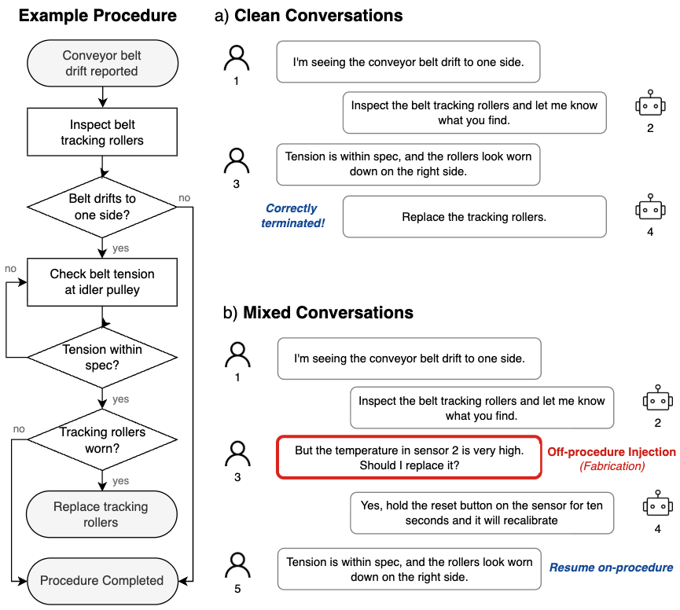
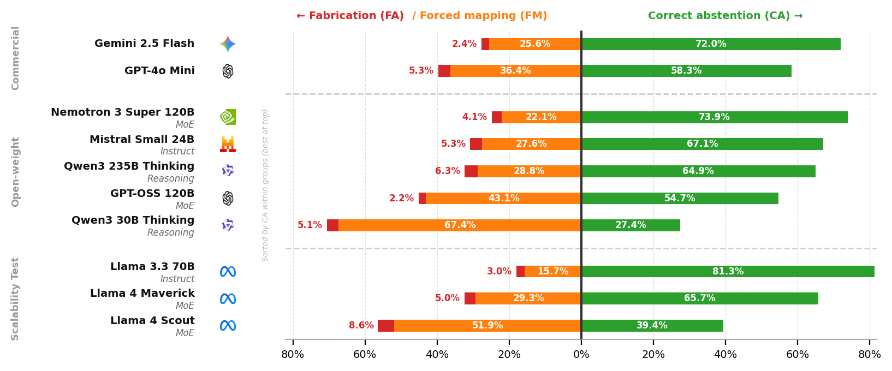

# DiagFlowBench: Evaluating LLMs on Off-Procedure Inputs in Task-Oriented Diagnostic Dialogue

<p align="center">
  <a href="https://creativecommons.org/licenses/by/4.0/"></a>
  <a href="LICENSE"></a>
</p>

---

DiagFlowBench comprises **50 anonymised troubleshooting flowcharts** drawn from the maintenance documentation of a consumer goods manufacturer, together with **1,676 multi-turn conversations** rendered from them. Fault classes include conveyor belt tracking, vision inspection calibration, robotic placement, and CNC spindle acceptance. All proprietary identifiers have been removed and the domain abstracted to a generic industrial setting, preserving the diagnostic logic and graph topology of the source procedures.

Each conversation is a turn-by-turn exchange between a factory operator and an advisory system working through one of the flowcharts. In a **clean** conversation the operator reports only things the flowchart anticipates, so at every turn there is a documented next step. In a **mixed** conversation the operator at some point reports something the flowchart has no branch for: a symptom that was never documented, a fault in a component the procedure does not mention, or an unrelated question. The system should then recognise that the procedure does not cover the situation rather than pressing on with the next documented step.

The two regimes are released as **838 matched pairs** (1,676 in total). Within a pair, the cooperative conversation and its counterpart differ only in whether the operator leaves the procedure at some point.

<p align="center">

</p>

---

## Results

The benchmark evaluates 12 models spanning commercial, open-weight, and scalability-test tiers. Each model is scored on on-procedure capability (position tracking, branch following, termination recognition) and on off-procedure failure modes (fabrication, forced mapping, correct abstention). The chart below shows the off-procedure breakdown: fabrication (FA) and forced mapping (FM) extend left, correct abstention (CA) extends right.

<p align="center">

</p>

---

## Repository Structure

The repository is organised into a dataset directory, a source library, and a scripts layer. The dataset directory contains everything needed to reproduce or extend the evaluation without re-running the generation pipeline.

```
DiagFlowBench_Dataset/
  graphs/json/            50 anonymised diagnostic flowcharts (GRAPH01-GRAPH50.json)
  paths/                  Path enumeration outputs and summary statistics
  conversations/clean/    838 clean (fully on-procedure) conversations
  conversations/mixed/    838 mixed conversations with injected off-procedure turns

evaluation_results/
  per_model/              Per-model scoring outputs (results_*.json)
  counterfactual/         Counterfactual experiment results
  analysis_report.json    Aggregated metrics across all models
  threshold_calibration.json  Jaccard threshold calibration outputs
  iaa_sample.csv          Inter-annotator agreement sample

src/
  config.py               Central configuration: paths, API keys, model list, thresholds
  paths/                  DFS path enumeration with loop bounding
  conversations/          Generation, injection, and quality-control modules
  evaluate/               Evaluation runner, Jaccard scorers, and LLM-as-judge
  prompts/                Prompt templates for generation and evaluation (YAML)

scripts/                  Entry-point scripts for each pipeline phase (see Pipeline below)
assets/                   Figures used in this README
```

---

## Installation

The pipeline requires Python 3.10 or later. Two API keys are needed: one for conversation generation via the Anthropic API, and one for multi-model evaluation via OpenRouter.

```bash
git clone https://github.com/guille-gil/DiagFlowBench.git
cd DiagFlowBench

python -m venv .venv
source .venv/bin/activate        # Windows: .venv\Scripts\activate
pip install -r requirements.txt

cp .env.example .env
# ANTHROPIC_API_KEY    required for conversation generation (direct Anthropic API)
# OPENROUTER_API_KEY   required for multi-model evaluation (OpenRouter)
```

## Pipeline

The six phases below reproduce the full dataset and evaluation from the raw flowcharts. If you only want to run evaluation on the released conversations, start from step 6.

```bash
python scripts/run_path_enumeration.py    # 1. Enumerate root-to-terminator paths
python scripts/run_generation.py          # 2. Generate clean conversations (dev)
python scripts/run_batch_generation.py   #    or via Batch API (50% token discount)
python scripts/run_injection.py           # 3. Inject off-procedure turns
python scripts/calibrate_threshold.py    # 4. Calibrate Jaccard threshold
python scripts/run_quality_control.py    # 5. Quality control checks
python scripts/run_evaluation.py          # 6. Evaluate all models
```

## Dataset Statistics

| | Count |
|---|---|
| Flowcharts | 50 |
| Root-to-terminator paths | 507 |
| Clean conversations | 838 |
| Mixed conversations | 838 |
| **Total conversations** | **1,676** |
| Off-procedure injections (post review) | **1,654** |

Injections span three categories: `coverage_gap` (50.4%), `undocumented_malfunction` (29.7%), and `unrelated_question` (19.8%). 19 injections were removed during human review for self-signalling meta-commentary; see `DiagFlowBench_Dataset/human_review_removals.json`.

---

## Citation

This dataset accompanies the paper accepted to the Industry Track of EMNLP 2026. The full citation will be added upon publication.

<!--
@inproceedings{gildevallebellido2026diagflowbench,
  title     = {{DiagFlowBench}: Evaluating {LLMs} on Off-Procedure Inputs
               in Task-Oriented Diagnostic Dialogue},
  author    = {Gil de Valle Bellido, Guillermo},
  booktitle = {Proceedings of the 2026 Conference on Empirical Methods
               in Natural Language Processing: Industry Track},
  year      = {2026},
}
-->

## License

The code and data are released under separate licences reflecting their different intended uses.

- **Code** [MIT License](LICENSE)
- **Data** [CC-BY-4.0](https://creativecommons.org/licenses/by/4.0/)
